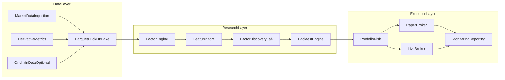

---

name: 加密量化平台路线
overview: 从零搭建一个以研究优先为核心的加密因子发现、回测、交易平台，第一版覆盖中低频现货选币与永续合约因子研究。默认采用 Python 技术栈，先打通数据、因子、评估、回测闭环，再逐步接入模拟盘与实盘。
todos:

- id: bootstrap_repo
content: 定义研究优先的平台边界，搭建 Python 项目骨架、配置系统与目录结构。
status: pending
- id: build_data_layer
content: 设计统一数据模型，先用 Parquet + DuckDB 落地现货与永续合约数据湖。
status: pending
- id: implement_factors
content: 实现首批 10-15 个高质量因子，并建立因子注册、元数据与可复用计算接口。
status: pending
- id: build_research_lab
content: 实现因子评估模块，包括 IC、分层收益、衰减、冗余与稳健性分析。
status: pending
- id: build_backtest_engine
content: 实现带手续费、滑点、资金费率和仓位约束的组合回测引擎。
status: pending
- id: paper_trade_loop
content: 预留 Broker 抽象并接入模拟盘，把研究、回测、下单、风控闭环跑通。
status: pending
isProject: false

---

# 加密量化平台路线图

## 阅读导航

- 目标与默认假设
- 为什么这样起步
- 第一版总体架构
- 推荐目录骨架
- 数据层设计
- 因子层设计
- 因子评估模块设计
- 回测引擎设计
- 交易执行层规划
- 风控与组合层设计
- 报告与监控层设计
- 最小可用版本（MVP）
- 第二阶段扩展
- 实现原则
- 推荐的落地顺序
- 交付标准

## 目标与默认假设

### 聚焦范围

- 第一版优先解决“因子发现 + 回测研究”问题，而不是一上来做高频或复杂实盘执行。
- 覆盖两类核心场景：
  - 中低频现货选币/轮动：`1h`、`4h`、`1d`
  - 永续合约研究：`funding rate`、`open interest`、`basis`、`liquidations`
- 当前工作区是空仓库，适合直接按新项目方式搭建。

### 默认技术栈

- 研究层：`Python` + `pandas/polars` + `numpy`
- 本地数据层：`Parquet` + `DuckDB`
- 交易所接入：`ccxt`（REST），后续可补 `ccxt.pro` 或其他 WebSocket 接入
- 快速原型回测：可借助 `vectorbt` 做验证；正式平台仍建议自建回测与执行抽象
- 若后续需要更完整的衍生品/盘口历史数据，可评估 `Tardis.dev` 这类专业数据源

## 为什么这样起步

- 你现在选的是“研究优先”，所以最重要的是先建立一个稳定、可重复的研究闭环：`数据 -> 因子 -> 评估 -> 回测 -> 结果归档`。
- 对加密来说，单纯做 OHLCV 不够，永续合约研究必须把 `funding/OI/basis/liquidations` 当成一等公民。
- 不建议第一版就做高频盘口和做市，因为那会把平台复杂度直接拉到“低延迟系统”级别，和当前目标不匹配。

## 第一版总体架构

## 推荐目录骨架

- `pyproject.toml`：项目依赖与入口
- `src/signal_lab/config/`：环境配置、交易所配置、路径配置
- `src/signal_lab/data/`：数据采集、标准化、落盘、校验
- `src/signal_lab/features/`：基础特征与因子计算
- `src/signal_lab/factors/`：按类别组织的因子实现与注册表
- `src/signal_lab/research/`：IC、分层收益、相关性聚类、参数扫描
- `src/signal_lab/backtest/`：组合构建、撮合、成本模型、资金费率结算
- `src/signal_lab/portfolio/`：仓位、杠杆、风险约束、净值计算
- `src/signal_lab/execution/`：模拟盘/实盘 broker 抽象与交易所适配
- `src/signal_lab/reporting/`：回测报告、因子报告、绩效归因
- `configs/`：因子、策略、数据源、风控参数
- `research/notebooks/`：探索式研究 notebook
- `tests/`：核心模块测试

## 数据层设计

### 1. 统一数据模型

第一版建议至少标准化以下表或数据集：

- `ohlcv`
- `funding_rates`
- `open_interest`
- `basis_or_premium`
- `liquidations`
- `ticker_or_top_of_book`
- `asset_metadata`
- `onchain_metrics`（可留接口，第二阶段接）

每条记录至少包含：

- `ts`
- `exchange`
- `symbol`
- `market_type`（spot/perp）
- `base_asset` / `quote_asset`
- `value fields`
- `source`

### 2. 存储策略

- 原始数据层：保留交易所原始字段，便于回溯。
- 标准化层：统一字段、统一时区、统一 symbol 命名。
- 特征层：只保存可复用的中间特征，避免每次重复计算。
- 本地先使用 `Parquet + DuckDB`，原因是：
  - 开发快
  - 查询快
  - 成本低
  - 非常适合研究与回测
- 等你确认要多人协作或需要持续实时服务时，再补 `Postgres/ClickHouse/Redis`。

### 3. 数据采集顺序

优先顺序建议：

1. `Binance` / `OKX` 的现货与永续 `OHLCV`
2. `funding rate`
3. `open interest`
4. `liquidations`
5. `top of book` 或简化盘口
6. 链上指标

不要一开始接太多交易所。第一版只做 `1-2` 家主流所，更容易把数据质量打磨好。

## 因子层设计

### 因子实现标准化

每个因子不要写成散落 notebook 里的脚本，应该有统一契约：

- 输入：标准化后的面板数据
- 输出：按 `timestamp x asset` 对齐的因子值
- 元数据：
  - 因子名称
  - 频率
  - 预热窗口
  - 是否需要截面标准化
  - 是否需要中性化
  - 可交易 universe 过滤条件
  - 适用品类（spot/perp）

### 第一版建议的因子篮子

先做少量但信息互补的因子，而不是一次做几十个：

- 趋势类：`1h/4h/1d/7d return`、`breakout`、`RSI`
- 均值回归类：`z-score`、`bollinger distance`
- 流动性类：`volume surge`、`spread proxy`、`Amihud`
- 衍生品类：`funding`、`OI change`、`price + OI regime`
- 横截面类：`relative strength vs BTC/ETH`、`sector relative momentum`

建议先做 `10-15` 个高质量因子，把评估体系跑顺，再扩展。

## 因子评估模块设计

### 第一版重点能力

平台价值不在“算出指标”，而在“知道哪些因子真有用”。第一版要重点建设以下评估能力：

- `IC / RankIC`
- 分层收益（quantile spread）
- 因子衰减曲线
- 换手率
- 因子间相关性与冗余分析
- 市场状态分层评估：
  - 牛市/熊市
  - 高波动/低波动
  - 资金费率极端区间
- 稳健性检验：
  - 滚动窗口
  - walk-forward
  - 参数扰动
  - 不同交易所复现

这里的目标不是找“历史最强因子”，而是找“在不同区间都还能活下来的因子”。

## 回测引擎设计

### 双层回测架构

对你的当前目标，更合适的是“双层回测”架构：

- 研究回测层：
  - 面向因子与截面选币
  - 支持向量化快速扫描
  - 用来跑 IC、分层收益、参数网格
- 组合回测层：
  - 面向真实组合净值
  - 支持手续费、滑点、调仓、杠杆、资金费率
  - 更贴近未来模拟盘/实盘执行

### 回测中必须显式建模的约束

- 手续费
- 滑点
- 成交量约束
- 最小下单单位
- 杠杆与保证金占用
- 资金费率结算
- 持仓上限
- 单币种权重上限
- 信号延迟与下单延迟

很多因子研究死在这里：研究时赚钱，回测时不赚钱，本质上是没有把交易摩擦和可成交性建进去。

## 交易执行层规划

虽然你当前选的是研究优先，但平台从第一天就要预留执行抽象，否则后面会推倒重来。

### 执行层核心抽象

- `Broker`：统一下单/撤单/查询持仓接口
- `ExchangeAdapter`：不同交易所 API 适配
- `OrderIntent`：策略层只表达“想买多少”，不碰底层细节
- `ExecutionPolicy`：市价、限价、post-only、reduce-only 等规则
- `PositionSync`：账户仓位与平台状态校准

### 建议顺序

1. 先做 `PaperBroker`
2. 再接单交易所模拟真实 API
3. 最后才接 `LiveBroker`

不要反过来。先打通模拟盘，会让你更早发现策略与回测的偏差。

## 风控与组合层设计

### 第一版风险约束

第一版至少要实现这些风险约束：

- 单币最大权重
- 单方向最大净敞口
- 最大杠杆
- 最大回撤熔断
- 流动性过滤
- funding 极端时降杠杆
- 数据异常时停止交易
- 交易所连接异常时停止交易

如果你后面做永续合约，这一层的重要性几乎和 alpha 一样高。

## 报告与监控层设计

### 平台需要回答的问题

平台必须能回答这几类问题：

- 这个因子为什么有效？
- 这个策略赚的钱来自哪里？
- 是价格趋势赚的，还是 funding carry 赚的？
- 最近失效是因子衰减，还是交易成本变差？

### 第一版至少包含的报告

所以第一版报告至少包括：

- 因子报告：IC、分层收益、相关性、稳定性
- 策略报告：收益、Sharpe、Sortino、Calmar、最大回撤、换手、持仓分布
- 成本归因：手续费、滑点、funding
- 风险暴露：BTC beta、行业暴露、交易所暴露

## 最小可用版本（MVP）

如果你现在就开工，最合理的 MVP 不是“全能平台”，而是下面这一版：

- 接入 `Binance` 与 `OKX`
- 拉取 `spot/perp OHLCV + funding + OI`
- 建立本地 `Parquet + DuckDB` 数据湖
- 做 `10-15` 个核心因子
- 做一套统一因子评估报告
- 做一套组合回测引擎
- 策略先只实现两类：
  - 现货截面动量轮动
  - 永续合约趋势 + funding/OI 确认
- 执行只做到 `PaperBroker`

这版做出来，你就已经拥有真正可用的研究平台了。

## 第二阶段扩展

当 MVP 稳定后，再按收益/复杂度比去扩：

- 链上数据接入
- 情绪/新闻/事件数据
- 多交易所统一账户视图
- 实盘执行
- 策略编排与定时调度
- 在线特征更新
- 因子库版本管理
- 模型训练与机器学习因子
- 更细粒度盘口回测

## 实现原则

- 先保证“可重复研究”，再追求“更复杂 alpha”。
- 先做“少量高质量因子”，不要一开始堆几百个指标。
- 先做“真实成本回测”，不要只看裸收益。
- 先做“标准化数据模型”，后面接链上、情绪、事件数据才不会乱。
- 先做“模拟盘”，再上实盘。

## 推荐的落地顺序

1. 建项目骨架与配置系统
2. 建统一数据模型与本地数据湖
3. 接入交易所历史数据抓取
4. 做第一批因子与因子注册表
5. 做因子评估报告
6. 做组合回测引擎
7. 做 PaperBroker 与风控
8. 用 1-2 个策略把全链路跑通

## 交付标准

当第一版完成时，你应该能做到：

- 一条命令刷新数据
- 一条命令重算因子
- 一条命令生成因子报告
- 一条命令运行回测
- 一条命令启动模拟盘
- 对任一策略，都能追溯：用了哪些数据、哪些因子、参数是多少、回测结果如何、真实交易成本假设是什么

