# Signal Lab 架构改造草案

这份文档针对当前仓库提出下一阶段架构改造方案，目标不是推翻现有实现，而是在保留现有 `data / factors / features / research / backtest` 骨架的前提下，把项目从“能研究单策略和做同场比较”的平台，演进成“能持续接入因子、批量孵化策略、并支持多策略同时运行”的信号实验室。

## 1. 改造目标

当前项目已经具备研究平台骨架，但还没有完全长成目标中的“策略实验室”。这次改造希望明确解决下面 5 件事：

1. 新增因子时，不需要继续把实现手工塞进中心化 `default_registry()`。
2. 新增策略时，不需要继续把“信号生成”和“权重生成”绑在一个类里。
3. 批量实验时，不再主要依赖复制很多份 YAML 文件来手动调参。
4. 多策略运行时，不再只做“同场比较”，而是具备真正的组合层和资金分配层。
5. 每次实验都能被稳定追溯，包括配置版本、代码版本、数据版本和产物索引。

一句话概括目标状态：

> `Signal Lab` 应该从“因子研究平台”升级成“因子工厂 + 策略工厂 + 组合实验室”。

## 2. 当前架构判断

当前仓库已经做对的部分：

- `data`、`factors`、`features`、`research`、`backtest`、`execution` 这些核心层已经分开。
- `FeatureBuilder`、`FactorResearchLab`、`PortfolioBacktester`、`StrategyRunner` 形成了完整闭环。
- 策略已经支持注册与发现，说明项目意图并不是写死一两条策略。
- `comparison` 模块已经解决了“同条件下比较多条策略”的问题。
- 每次运行会产出 `run_manifest.json`，已经有实验追溯意识。

当前最主要的结构缺口：

- 因子注册仍然是手工装配，扩展性不对称。
- `Strategy` 抽象同时承担“信号逻辑”和“仓位逻辑”，对多策略扩展不友好。
- `StrategyRunner` 对 `factor` 与 `strategy` 走两套主分支，后续容易继续膨胀。
- `comparison` 只解决横向比较，没有进入多策略组合层。
- `configs/` 已经开始扁平化膨胀，继续扩展会越来越依赖命名约定而不是结构约定。
- 当前没有实验索引层，只有运行目录和 manifest，缺少批量检索能力。

所以目前的准确定位是：

- 它已经不是单策略项目。
- 它也还不是完整的多策略实验室。
- 它正处在“研究平台骨架已成型，但实验管理和组合层尚未独立出来”的阶段。

## 3. 改造原则

这次改造建议遵守下面 6 条原则：

### 3.1 先补抽象，再补功能

不要一边继续加策略，一边让 `StrategyRunner` 和 `configs/` 越来越臃肿。应该先把运行时抽象理顺，再继续扩因子和扩策略。

### 3.2 尽量保留已有主干

以下模块不建议大拆：

- `data`
- `features`
- `research`
- `backtest`
- `execution`
- `reporting`

这些层已经是平台底座，短期内更需要的是在其上补新的编排层和组合层。

### 3.3 把“信号”和“仓位”拆开

信号回答的是“看多谁、看空谁、强度多大”；仓位回答的是“给多少权重、受哪些风险约束、如何调仓”。这两个概念必须解耦。

### 3.4 把“单策略”与“多策略组合”拆成两层

单策略只负责输出自己的目标权重，多策略组合层再决定多个策略之间如何分资金、如何做净敞口控制、如何做冲突处理。

### 3.5 配置要支持组合与继承

随着策略、因子和市场增多，配置一定会膨胀。应该尽早从“扁平文件集合”转向“基础配置 + 变体覆盖 + 实验矩阵”的组织方式。

### 3.6 优先做兼容式迁移

当前已有：

- `trend_confirmation`
- `crowding_reversal`
- `ma_crossover`
- `run-strategy`
- `compare-strategies`

改造建议优先通过 adapter 兼容旧接口，而不是一次性推翻。

## 4. 目标架构

目标状态下，运行链路建议变成下面这张图：

```mermaid
flowchart LR
  subgraph dataLayer [Data And Feature Layer]
    data[Data Ingestion]
    lake[Data Lake And Warehouse]
    factors[Factor Packs]
    features[Feature Builder]
  end

  subgraph signalLayer [Signal Layer]
    signals[Signal Models]
    overlays[Signal Or Risk Overlays]
    allocators[Allocators]
  end

  subgraph strategyLayer [Strategy And Portfolio Layer]
    strategies[Strategy Specs]
    multi[Strategy Portfolio]
    risk[Portfolio Risk]
  end

  subgraph labLayer [Experiment Layer]
    experiments[Experiment Runner]
    registry[Run Registry]
    reporting[Reports And Diagnostics]
  end

  data --> lake
  lake --> features
  factors --> features
  features --> signals
  signals --> overlays
  overlays --> allocators
  allocators --> strategies
  strategies --> multi
  multi --> risk
  risk --> experiments
  experiments --> reporting
  experiments --> registry
```




这张图表达的是 4 件事：

1. 因子层继续存在，而且仍然是一等公民。
2. 策略不再直接等于“一个类里把所有事情做完”。
3. 多策略组合层会成为独立模块，而不是比较模块的延伸。
4. 实验运行与结果索引会被提升成独立能力。

## 5. 推荐模块拆分

建议在保留现有目录的基础上，逐步引入下面几层。

### 5.1 保留并强化 `factors/`

`factors/` 仍然负责：

- 因子契约
- 因子元数据
- 因子计算
- 因子版本
- 因子注册

但它要从“手工内建注册表”升级成“可发现的 factor packs”。

建议方向：

- 保留 `PandasFactor` 和 `FactorMetadata`
- 引入 `register_factor` 装饰器或模块发现机制
- 允许按配置加载一组 factor modules
- `default_registry()` 从“手工清单”升级成“默认加载器”

### 5.2 新增 `signals/`

新增 `signals/`，专门放“信号生成逻辑”。

典型职责：

- 声明依赖哪些因子
- 把因子面板转成信号面板
- 输出横截面评分、方向、置信度或 regime 标签

示例：

- `trend_confirmation_signal`
- `crowding_reversal_signal`
- `ma_cross_signal`
- `breakout_confirmation_signal`

### 5.3 新增 `allocators/`

新增 `allocators/`，专门负责把信号变成目标权重。

典型职责：

- 选前 `N` 个多头和空头
- 做市场中性或方向性分配
- 做 gross / net / 单标的权重约束
- 应用成交量、资金费率、爆仓事件等风险约束

示例：

- `ranked_cross_sectional_allocator`
- `binary_regime_allocator`
- `vol_target_allocator`
- `event_aware_allocator`

### 5.4 重塑 `strategies/`

`strategies/` 不建议继续作为“原始逻辑都写在里面”的目录，而建议变成组合层 facade。

它应该负责：

- 把 `signal + allocator + overlays + defaults` 组装成一个可运行策略规范
- 兼容旧策略入口
- 对外保留 `create_strategy()` 这一层用户接口

也就是说，未来的 `trend_confirmation` 更像一个装配件，而不是唯一的实现容器。

### 5.5 新增 `strategy_portfolios/`

这是当前最缺的一层，建议显式新增。

这层负责：

- 管理多个策略 sleeve
- 做策略级别资金分配
- 处理策略间相关性和冲突
- 控制总杠杆、净敞口、单市场上限
- 为后续 paper/live 执行提供统一上层目标权重

典型对象：

- `equal_weight_strategy_portfolio`
- `risk_budget_strategy_portfolio`
- `correlation_capped_strategy_portfolio`

### 5.6 新增 `experiments/`

新增 `experiments/`，把“批量实验”和“参数扫描”从 `comparison` 与 `orchestration` 中独立出来。

这层负责：

- 读取实验矩阵
- 生成变体配置
- 并行或串行执行多个 run
- 汇总指标
- 写入实验清单
- 为后续自动选优、walk-forward、regime 分层提供入口

### 5.7 收敛 `comparison/`

`comparison/` 不必消失，但应该逐步从“独立 runner”收敛成“实验结果视图”。

建议定位改成：

- 比较报告渲染
- 共享假设校验
- 策略间指标对齐展示

而不是继续单独持有自己的运行主逻辑。

## 6. 关键运行时抽象

建议把核心抽象明确成下面几层。

### 6.1 Factor

职责：

- 从标准化数据生成可复用特征
- 提供稳定 metadata 和 version

保留现有方向即可。

### 6.2 SignalModel

职责：

- 输入多个因子面板
- 输出标准化信号面板

建议接口形态：

```python
class SignalModel(Protocol):
    @classmethod
    def from_options(cls, options: dict[str, object] | None = None) -> "SignalModel":
        ...

    def required_factors(self) -> list[str]:
        ...

    def build_signal_frame(self, factors: dict[str, pd.DataFrame]) -> pd.DataFrame:
        ...
```

### 6.3 Allocator

职责：

- 输入信号面板
- 输出目标权重

建议接口形态：

```python
class Allocator(Protocol):
    @classmethod
    def from_options(cls, options: dict[str, object] | None = None) -> "Allocator":
        ...

    def required_risk_features(self) -> list[str]:
        ...

    def build_weights(
        self,
        signal_frame: pd.DataFrame,
        risk_features: dict[str, pd.DataFrame] | None = None,
    ) -> pd.DataFrame:
        ...
```

### 6.4 StrategySpec

职责：

- 定义一次单策略运行的装配结果
- 绑定 `signal model`、`allocator`、默认风险规则、默认执行假设

它本身不一定需要承载全部实现逻辑，更适合做一份 declarative spec。

### 6.5 StrategyPortfolio

职责：

- 输入多个策略的目标权重
- 输出一个统一的顶层组合权重

这个抽象是当前架构中最关键的新层，也是未来 paper/live 真正要消费的对象。

### 6.6 ExperimentSpec

职责：

- 描述一次实验矩阵
- 记录变体、基线、共享假设和评估维度

它应该成为：

- `compare-strategies`
- 参数扫描
- 多市场复现
- walk-forward

这些能力的共同上层配置入口。

## 7. 配置结构改造建议

当前 `configs/` 扁平文件已经开始增多，建议逐步过渡为下面这种结构：

```text
configs/
  app/
    binance-recent1y.yaml
    binance-recent4y.yaml
  strategies/
    trend-confirmation.yaml
    crowding-reversal.yaml
    ma-crossover.yaml
  portfolios/
    single-strategy.yaml
    balanced-multi-strategy.yaml
  experiments/
    trend-baseline.yaml
    crowding-baseline.yaml
    trend-vs-crowding.yaml
    ma-crossover-sweep.yaml
  factor-packs/
    default.yaml
    perp-derivatives.yaml
```

建议同时引入下面 3 个概念：

### 7.1 base + overlay

不要每次完整复制一份工作流，而是：

- `base` 负责共享默认值
- `overlay` 只覆盖差异参数

这样可以减少：

- 同类实验配置飘逸
- 一个阈值改了十几份文件
- 无法看出本次实验到底改了什么

### 7.2 显式声明信号与仓位

未来策略配置建议类似下面这样：

```yaml
strategy:
  name: trend_confirmation_v2
  signal:
    type: trend_confirmation
    options:
      momentum_factor: ret_24
      breakout_factor: breakout_20
  allocator:
    type: ranked_cross_sectional
    options:
      max_long_positions: 2
      max_short_positions: 2
      long_allocation: 0.5
      short_allocation: 0.5
  overlays:
    - type: liquidation_event_overlay
      options:
        max_liquidation_spike_zscore: 2.5
```

这样做的价值是：

- 同一个 signal 可以复用多个 allocator
- 同一个 allocator 可以复用多个 signal
- 策略变成可组合对象，而不只是单个 Python 类

### 7.3 引入实验矩阵

实验配置建议显式支持参数扫描：

```yaml
experiment:
  name: ma_crossover_recent4y_sweep
  base_strategy: strategies/ma-crossover.yaml
  variants:
    - name: fast30_slow120
      overrides:
        strategy.signal.options.fast_ma_factor: ma_distance_30
        strategy.signal.options.slow_ma_factor: ma_distance_120
    - name: fast20_slow60
      overrides:
        strategy.signal.options.fast_ma_factor: ma_distance_20
        strategy.signal.options.slow_ma_factor: ma_distance_60
```

## 8. 运行与产物改造建议

当前已经有 `run_manifest.json`，这是很好的开始，但建议补全下面这些字段：

- `experiment_id`
- `variant_id`
- `config_hash`
- `git_sha`
- `data_snapshot_id`
- `factor_registry_version`
- `app_config_path`
- `strategy_config_path`
- `portfolio_config_path`

同时建议新增一个轻量 `run registry`，形式可以先从简单方案开始：

1. 第一阶段用 `JSONL` 或 `SQLite`
2. 后续有需要再接更完整的实验管理工具

这个 registry 主要解决下面几个问题：

- 跑过哪些实验
- 每次实验对应什么配置哈希
- 哪个配置在什么数据快照上效果最好
- 是否能重现某次历史结果

## 9. 迁移路径

建议按 4 个阶段推进，而不是一次性大改。

### 阶段 1：补注册与元数据，不改用户心智

目标：

- 因子支持 discovery 或 factor pack
- manifest 增加 `config_hash / git_sha / data_snapshot_id`
- `configs/` 开始引入子目录，但保留兼容路径

这一阶段不要求用户改变 `run-strategy` 的习惯。

### 阶段 2：拆分 signal 与 allocator

目标：

- 新增 `signals/` 与 `allocators/`
- 现有 `trend_confirmation`、`crowding_reversal`、`ma_crossover` 先拆成内部组合件
- `strategies/` 保留兼容 facade
- `StrategyRunner` 逐步改成统一处理 `SignalSpec`

这一阶段完成后，新策略就不应该继续直接写成“一个类里又出信号又出权重”的模式。

### 阶段 3：引入 experiments 与 batch runner

目标：

- 支持 sweep
- 支持批量实验 manifest
- `comparison` 逐步复用 experiment runner 的结果而不是自己再跑一套

这一阶段完成后，实验规模可以从“手工几份 YAML”提升到“可维护的实验矩阵”。

### 阶段 4：引入多策略组合层

目标：

- 新增 `strategy_portfolios/`
- 支持多个策略同时出顶层权重
- 在 backtest / paper 层统一消费顶层组合目标权重

这一阶段完成后，项目才真正接近“很多策略在跑”的目标形态。

## 10. 首批建议改动的代码触点

如果按最小扰动来做，首批最值得动的文件是下面这些：

- `src/signal_lab/factors/__init__.py`
  - 目标：从手工 `default_registry()` 过渡到默认发现式加载器。
- `src/signal_lab/features/builder.py`
  - 目标：支持按配置注入 factor packs，而不是只依赖默认注册表。
- `src/signal_lab/strategies/base.py`
  - 目标：从单一 `Strategy` 协议过渡到 `SignalModel + Allocator + StrategyFacade`。
- `src/signal_lab/orchestration/runner.py`
  - 目标：收敛 `factor` 与 `strategy` 的双分支，拆成更清晰的阶段式流水线。
- `src/signal_lab/comparison/runner.py`
  - 目标：逐步收敛成实验结果比较视图，而不是独立执行引擎。
- `src/signal_lab/cli.py`
  - 目标：新增 `run-experiment`、`run-portfolio` 之类的入口。
- `configs/`
  - 目标：从扁平命名迁移到分层组织。

## 11. 明确不建议现在做的事

为了避免架构讨论失控，这轮改造不建议把范围扩大到下面这些方向：

- 不重写数据湖
- 不把 `DuckDB` 替换成更重的数据基础设施
- 不做高频或盘口级实时架构
- 不引入复杂分布式调度系统
- 不一次性重构所有已有策略和所有命令

这轮改造的重点不是“上更大的技术栈”，而是把平台抽象补齐。

## 12. 完成态定义

当下面这些条件被满足时，可以认为这轮架构改造基本达标：

1. 新增一个因子时，不需要再编辑中心化注册清单。
2. 新增一个策略时，可以通过 `signal + allocator + overlay` 组合完成。
3. 运行一组参数变体时，可以通过实验配置一次性执行并产出统一清单。
4. 多条策略可以被组合到一个顶层组合中统一回测或模拟运行。
5. 任意一次结果都能追溯到配置、代码版本和数据快照。

## 13. 推荐落地顺序

如果只做一轮最有性价比的改造，推荐顺序如下：

1. 先做因子注册与 run metadata 补强。
2. 再做 `signals/` 和 `allocators/` 拆分。
3. 然后做 `experiments/` 和 batch runner。
4. 最后再进入 `strategy_portfolios/`。

这个顺序的原因是：

- 它兼容当前已有仓库结构。
- 它不会立刻打断现有 baseline 和测试。
- 它能尽快把“继续加东西会越来越乱”的问题先止住。

## 14. 结论

当前 `Signal Lab` 的底座已经搭得不错，短板不在数据、因子和回测，而在更上层的“策略抽象、实验管理和多策略组合”。

因此，最合理的演进方向不是重写平台，而是：

- 保留现有研究底座
- 拆清 signal 和 allocator
- 独立 experiments
- 增加 strategy portfolio

这样改完以后，这个仓库才会真正符合最初的目标：把各种因子持续接进来，快速试验，持续筛选，最后让很多策略在一个统一平台里稳定运行。