# Cross-Sectional Alpha Research Pipeline Readiness Audit

## 0. Executive decision

截至 `2026-08-18`，`quant-strategy-lab` **具备搭建工业化 cross-sectional alpha pipeline 的重要零件，但尚不是可重复、可扩展、成本与容量可信的工业化平台**。总体判定为：

> `PARTIAL / NOT INDUSTRIAL-READY`

这不是从零开始。仓库已经证明以下能力可以在本地规模上工作：

1. 数据湖身份、UTC、闭合 K 线、重复键、连续性与来源审计；
2. 版本化 factor registry、因果 rolling features 与 feature manifest；
3. Binance 历史全市场 point-in-time 流动性币池；
4. K0 close 生成信号、K1 open 入场的多期限 long/short/tail 标签；
5. purged、nested、expanding walk-forward 与 OOF prediction；
6. Ridge / LightGBM regression、classification、ranker 与允许空仓的 allocator；
7. 结果冻结、SHA、一次性 OOS 和历史事故纠错。

但这些能力大多分散在单一研究家族脚本中，尚未形成稳定的 `Universe -> Panel -> Dataset -> Diagnostics -> Model -> Neutralization -> Portfolio -> Cost/Capacity -> Registry` 接口。尤其是成本与容量仍主要是固定 fee/slippage/funding，无法回答“小资金高年化 alpha 在资金增大时如何衰减”。

### P0 blockers

在开始大规模挖 alpha 之前，必须先解决：

1. **Instrument master / PIT metadata**：没有有效期化的 listing、delisting、status、tick、step、min notional、contract identity、alias/symbol mapping。
2. **可复用 panel API**：`FeatureBuilder` 仍以单 symbol 为主；真正的 panel 逻辑只存在于家族脚本。
3. **通用 label 与 split API**：正确实现已存在，但绑定在已归档 `BIN-1H-MHCSML` 脚本。
4. **Alpha diagnostics 层**：缺少统一 ICIR、quantile monotonicity、decay、turnover、regime stability、breadth、alpha correlation、PnL attribution。
5. **Neutralization / exposure model**：只有字段占位，没有可执行的 dollar/beta/sector/size/liquidity/vol neutralization。
6. **Cost & capacity**：缺少 spread、maker/taker schedule、orderbook depth、impact、exchange filters 与 capital-size curve。
7. **Experiment registry**：只有 SQLite 路径，没有 registry 实现；试验次数和多重检验无法全局追踪。
8. **当前数据可运行性**：历史全市场 Binance `15m` 仍在，但旧全市场 `1h` OHLCV 与 MHCSML 模型/面板产物已清理；首个基线必须从 `15m` 重建。Hyperliquid 只有单标的级覆盖。

本审计不修改或删除现有 CTA/HYPE 研究，不恢复已归档家族，不把历史开发绩效当作新平台或新 alpha 的有效 OOS。

## 1. 审计边界与证据快照

- 仓库：`quant-strategy-lab`
- commit：`0afcd245b89b`
- branch：`cursor/pkc-campaign-and-mtf-research`
- 审计范围：active `src/strategy_lab/`、`docs/`、`research/`、`tests/`、本地 `data/`。
- `archive/` 只用于确认历史边界，不作为当前平台实现。
- 工作树在审计前已有大量未提交研究；本审计只新增本目录，不归因、不覆盖这些变更。

本地数据行数为物理文件 inventory，不等同于每个数据集已经通过 trusted loader：

| 数据集 | 本地物理覆盖 | 审计含义 |
| --- | --- | --- |
| Binance perp `15m` normalized OHLCV | `56,639,134` rows / `791` symbols；历史月档主源至 `2026-06`，少数主力延伸至 `2026-08-06` | Phase 1 最可靠的全市场价格/量价输入；必须按 source 和截止日避免后段 universe silently 缩成少数主力 |
| Binance perp `1h` normalized OHLCV | `395,615` rows / `543` symbols；只有 `6` 个 symbol 达到约一年覆盖 | 旧 MHCSML 所需的完整 `1h` 历史已不在；不能直接复跑旧 panel |
| Binance perp funding | `2,506,171` rows / `870` symbols，主要历史源从 `2020-01-01` | 历史覆盖较好，但须以有效 symbol mapping、event time 和 duplicate audit 合并 |
| Binance `1h` mark-price | `14,588,953` rows / `793` symbols，从 `2020-01-01` | 可用于 mark premium 与路径风险；index price 并无同等通用 normalized dataset |
| normalized open interest | `648` rows / `1` symbol | 不足以进入全市场 baseline |
| normalized basis/premium | `648` rows / `1` symbol | 不足以进入全市场 baseline；另有 raw premium archives，但未统一接入 trusted layer |
| raw derivatives metrics | `6,385` ZIP，仅 `BTC/ETH/SOL/BNB/TRX` | 适合局部诊断，不是全市场 panel |
| raw taker-flow archive | `807` ZIP，`13` symbols | 适合局部诊断；OHLCV 内的 taker-buy fields 才是 Phase 1 可用的广覆盖 flow proxy |
| Hyperliquid perp `1h` OHLCV | `7,471` rows / `1` symbol | 不具备 Hyperliquid 全市场 cross-sectional breadth |

## 2. 当前架构图与 readiness 标记

状态词：`已有` = 有 active 稳定实现；`部分已有` = 可复用但接口/覆盖不完整；`缺失` = 没有当前实现；`需要重构` = 有家族实现但不能直接作为平台接口。

```mermaid
flowchart LR
    D["Data\n部分已有\nDataLakeLayout / DuckDBWarehouse / quality"]
    U["Universe\n需要重构\nPIT logic only in family scripts"]
    F["Feature\n部分已有\nFactorRegistry / multi_asset_1h"]
    L["Label\n需要重构\nMHCSML multi-horizon labels"]
    DS["Dataset\n需要重构\nfamily-specific Parquet manifests"]
    TV["Train / Validation\n需要重构\npurged nested WF scripts"]
    P["Prediction\n需要重构\nOOF artifacts, no common adapter"]
    IC["IC / RankIC\n部分已有\nmean RankIC only"]
    PC["Portfolio\n需要重构\nfamily allocators"]
    N["Neutralization\n缺失\nno exposure engine"]
    C["Cost / Slippage\n部分已有\nfixed fee + 4bps + funding"]
    BT["Backtest\n需要重构\nno shared CS ledger"]
    WF["Walk-forward / OOS\n部分已有\nstrong family governance"]
    ER["Experiment Registry\n缺失\npath exists, implementation absent"]

    D --> U --> F --> L --> DS --> TV --> P --> IC --> PC --> N --> C --> BT --> WF --> ER
```



### 逐项映射到当前代码

| 环节 | 状态 | 当前证据 | 结论 |
| --- | --- | --- | --- |
| Data | 部分已有 | [`DataLakeLayout`](../../../src/strategy_lab/data/lake.py)、[`DuckDBWarehouse.load_trusted_ohlcv`](../../../src/strategy_lab/data/warehouse.py)、[`audit_ohlcv_frame`](../../../src/strategy_lab/data/quality.py) | OHLCV 质量内核强；非 OHLCV 的 event-time/as-of/连续性审计较弱 |
| Universe | 需要重构 | [`build_crypto_universe_catalog.py`](../../asset-portfolios/1h-cross-sectional-lightgbm-selector/scripts/build_crypto_universe_catalog.py)、`add_point_in_time_state()` 与 DuckDB Top-N in [`build_cross_sectional_factor_panel.py`](../../asset-portfolios/1h-cross-sectional-lightgbm-selector/scripts/build_cross_sectional_factor_panel.py)、月频 `pick_legs()` in [`research_binance_1d_mcsm_ls3.py`](../../asset-portfolios/1d-monthly-cs-momentum-ls3/scripts/research_binance_1d_mcsm_ls3.py) | PIT age/coverage/ADV 已证明可行，但静态 manual exclusions、无有效期 instrument master、无通用 API |
| Feature | 部分已有 | [`FactorMetadata`](../../../src/strategy_lab/data/factors/base.py)、[`FactorRegistry`](../../../src/strategy_lab/data/factors/base.py)、[`multi_asset_1h_registry`](../../../src/strategy_lab/data/factors/multi_asset_1h.py)、[`FeatureStore`](../../../src/strategy_lab/data/features/store.py) | 因果 time-series 因子库可复用；panel transforms、winsorize/z-score/neutralize 缺失 |
| Label | 需要重构 | `add_multihorizon_labels()` in [`build_multihorizon_factor_panel.py`](../../asset-portfolios/1h-multi-horizon-cross-sectional-ml-allocator/scripts/build_multihorizon_factor_panel.py)、[`long_net_return` / `short_net_return`](../../../src/strategy_lab/data/linear_contract_returns.py) | 正确 K1 open、多 horizon、funding、MAE/MFE、fail-closed 路径存在，但属于 archived family script |
| Dataset | 需要重构 | `prepare_development_model_matrix.py` 与 family JSON manifests | 有物理 outcome isolation 和 feature sets；无通用 dataset identity、schema/version/fingerprint API |
| Train/Validation | 需要重构 | `train_development_walk_forward.py` 的 7-fold expanding outer、48h purge、120d inner validation | 研究实现可靠；folds、任务、模型、artifacts 全部硬编码 |
| Prediction | 需要重构 | OOF `predictions.parquet` + model/diagnostic SHA | 有 artifact contract，无 `PredictionFrame` 公共 schema 和 model adapter |
| IC/RankIC | 部分已有 | `predictive_diagnostics()` in `train_development_walk_forward.py` | 有 global Spearman、mean cross-sectional RankIC、positive share；无统一 ICIR/decay/quantile monotonicity |
| Portfolio | 需要重构 | `select_legs()`、`scheduled_policy()`、`simulate_overlapping_sleeves()` in [`search_development_allocator.py`](../../asset-portfolios/1h-multi-horizon-cross-sectional-ml-allocator/scripts/search_development_allocator.py) | 有 long/short、threshold、Top-N、空仓、重叠 sleeves；无通用权重/约束/optimizer 接口 |
| Neutralization | 缺失 | `FactorMetadata.neutralized` 仅为字段；无消费者 | 必须新增 exposure matrix 与 residualization/constraint 层 |
| Cost/Slippage | 部分已有 | [`linear_contract_returns.py`](../../../src/strategy_lab/data/linear_contract_returns.py)、仓库默认 fee/slippage、funding | 固定成本可用；没有 symbol/venue/time-varying spread、maker/taker、impact、capacity |
| Backtest | 需要重构 | family-specific portfolio simulators；月频 MCSM 日路径 | 无统一 position/order/fill/funding/turnover ledger；旧空头公式事故说明公共 contract 必须集中 |
| Walk-forward/OOS | 部分已有 | MHCSML physical isolation、SHA freeze、blind prospective chain、一次性 reveal | 治理强但实现高度家族化；需要 registry 驱动 |
| Experiment Registry | 缺失 | `DataLakeLayout.run_registry_db_path` 只返回 `runs.sqlite` 路径 | 没有建表、写入、状态机、trial parentage 或 multiple-testing 记录 |

完整行动矩阵见 [gap-matrix.md](gap-matrix.md)。

## 3. 数据层审计

### 3.1 Panel data readiness

当前 active `DuckDBWarehouse.load_dataset()` 可以一次扫描多个 symbol，`compute_factor_frame()` 也认识 `symbol` group；但 `FeatureBuilder.build_symbol_features()` 的主要接口仍是逐 symbol。真正大规模 `(ts, symbol)` panel 是旧 CSLGBM/MHCSML 用 DuckDB 家族脚本构建的。因此判定：

- 存储格式可以承载 panel；
- 单资产因果 features 可以批量并行生成；
- panel join/rank/breadth/relative label 已有参考实现；
- **没有受测试、稳定、家族无关的 `PanelBuilder`**。

`RelativeStrengthFactor` 还暴露一个必须先修的接口歧义：其 `metadata.cross_sectional=True`，使 `compute_factor_frame()` 不按 symbol 分组；但 `compute()` 内部对整列直接 `pct_change()`。在真实多 symbol panel 中可能跨 symbol 边界计算，而现有测试只覆盖单一连续序列。Phase 1 不应调用该通用 factor，须先把“per-symbol time-series transform”和“per-ts cross-sectional transform”分成两个明确阶段。

### 3.2 字段覆盖

| 字段族 | 当前状态 | 证据与风险 | Phase 1 决策 |
| --- | --- | --- | --- |
| OHLCV / quote volume / trade count / VWAP | 已有 | 标准 schema 在 [`models.py`](../../../src/strategy_lab/data/models.py)；Binance `15m` 全市场覆盖最强 | 使用；从完整 `15m` 因果聚合为 `1h` panel，并保留输入 manifest |
| Taker buy volume/quote | 部分已有 | Binance Vision OHLCV 附加字段广覆盖，但不是标准 OHLCV required schema | 使用为 flow proxy；新增 schema/coverage gate，不把缺失填 0 |
| Funding | 已有但需重构 as-of | 历史覆盖广；`attach_funding()` 已用 backward as-of，label 使用实际 settlement | 使用；显式区分 latest-known rate 与 actual future settlements |
| Mark price | 部分已有 | Binance `1h` 历史较完整 | 使用 mark premium/风险诊断；必须按 event availability 对齐 |
| Index price | 部分/缺失 | `BasisPremiumRecord` 有字段，但没有全市场统一 normalized index-price 数据集 | Phase 1 不使用 |
| Open interest | 局部 | normalized 仅 1 symbol；raw derivatives metrics 仅五币且质量报告曾发现大段 null/错位 | Phase 1 排除；Phase 2 重建全市场 OI contract |
| Basis/premium | 局部 | normalized 仅 1 symbol；raw premium archive 未统一进入 trusted layer | Phase 1 仅用 mark/close proxy并明确命名；真 basis 进 Phase 2 |
| Liquidation | 接口有、数据无 | [`liquidations.py`](../../../src/strategy_lab/data/liquidations.py) 支持 Binance force-order normalization/aggregation；当前 normalized dataset 不存在 | Phase 1 排除；Phase 3 实时/短历史事件流 |
| Trade/order-flow | 部分 | OHLCV taker imbalance 可用；逐笔 trades、signed order flow 没有通用数据集 | Phase 1 用 bar proxy；Phase 3 逐笔 |
| Orderbook / top-of-book | schema 占位，数据缺失 | `DatasetKind.TICKER` 只有 bid/ask required schema；没有 depth/snapshot/delta contract | Phase 2 加 top-of-book；Phase 3 加 L2 replay |
| Market cap / float | 缺失 | 无 dataset kind、无 point-in-time vendor/source | 不做市值中性，不把“今日市值 Top N”伪装成历史 universe |
| Listing age | 部分 | 旧 panel 从首个本地 bar 推导 `age_hours` | 可作最低基线，但 instrument master 上线后改为 exchange onboard date + first trusted bar 双门禁 |
| Exchange metadata | 缺失/静态 | `ASSET_METADATA` 无 `ts/effective_from/effective_to`；没有 filters/tick/step/min notional | P0 必须新增有效期化快照 |

### 3.3 时间与未来函数

必须统一四个时间：

1. `event_ts`：交易所事件发生时间或 K 线 open time；
2. `available_ts`：研究系统最早可以知道该值的时间；
3. `signal_ts`：K0 完全闭合后生成 score 的时间；
4. `execution_ts`：最早可成交的 K1 open / next executable event。

当前 OHLCV 规范明确 `ts` 是开盘时间、`is_closed` 是闭合权威；这是正确基础。但 funding/metadata/mark/OI 的 `available_ts` 没有统一字段。仅靠 exact `ts` merge 或无上限 forward-fill 会产生 stale/提前可见风险。所有非 OHLCV as-of join 必须带 `max_staleness`、source latency 和 join audit。

### 3.4 缺失、上下市、mapping 与 survivorship

- 不允许对 price、mark、volume 或 nontradable interval forward-fill。
- funding 的“当前已知费率”可 backward as-of；未来持仓成本标签只能累加实际 settlement event。
- 历史下市币必须保留到当时最后可交易时点；不得用未来 delist 时间提前排除。
- 当前 catalog 对不在 current exchangeInfo 的历史合约采用 manual inference，并只显式排除少数 stable/index；这不足以长期维护。
- 需要 `canonical_instrument_id` 与 `(venue_symbol, effective_from, effective_to)` 映射；不能仅靠 `BTC/USDT:USDT` 字符串替换。
- contract rename、multiplier、quote asset、settlement asset、linear/inverse、deliverable/perp 必须进入身份。

## 4. Universe 设计

统一接口应返回一张不可变 membership panel：

```text
(decision_ts, instrument_id, eligible, rank, reason_codes,
 listing_age, coverage, trailing_adv, metadata_snapshot_id)
```

### 4.1 `historical_dynamic`

这是研究与 promotion 的默认模式：

- 当时 metadata 表示可交易；
- K0 已闭合；
- listing age >= `30d`；
- 过去 `30d` bar coverage >= `99%`；
- 用 K0 及以前的 `7d` 或 `30d` quote-volume 计算 ADV；
- 先过绝对流动性门槛，再按 lagged ADV 排 Top N；
- 下市只在状态实际生效后退出；
- stablecoin、index、delivery contract 等通过 versioned taxonomy 排除；
- 每个 reason code、输入 snapshot SHA 和 membership hash 持久化。

### 4.2 `current_top_n_retrospective`

仅用于回答“今天这批币历史上怎样”，必须：

- 冻结 `as_of_ts` 与 symbol list；
- 标记 `SURVIVORSHIP_BIASED_DIAGNOSTIC`；
- 不用于 alpha 选择、OOS、promotion 或与 dynamic universe 混合比较；
- 报告历史时点有多少 symbol 当时尚未上市/不可交易；
- 如果 Top N 来自 market cap，保存 vendor、snapshot、method 和 missing coverage。

两个模式不能共用同一个 `universe_id`，也不能把 retrospective 结果写成“历史前 N”。

## 5. Feature pipeline

### 5.1 可复用部分

- `FactorMetadata` 已含 name/category/lookback/inputs/market_types/formula/direction 和 source hash；
- `FactorRegistry` 可阻止重名并生成 factor spec；
- `multi_asset_1h_registry()` 已有 `142` 个基础因子，tail 扩展后旧 MHCSML 用过 `182` 个 base features；
- future-row perturbation tests 已验证这些 rolling factors 不读未来；
- `FeatureStore` 支持 factor version 与 identity 分区。

### 5.2 需要重构

1. `FeatureBuilder` 增加 `build_panel_features(panel, universe_membership)`，不能只暴露 `build_symbol_features()`。
2. 两阶段执行：
   - `time_series`: 每 symbol rolling；
   - `cross_sectional`: 每 decision_ts winsorize/z-score/rank/residualize。
3. 每个 transform 保存：fit universe、winsor limits、null policy、minimum breadth、version。
4. `FeatureStore.write_factor_frame()` 当前把整段 frame 写入 `date=max(ts)` 的单分区，增量刷新容易覆盖/重复；panel store 必须按实际 UTC date/month 分区并以 `(ts, instrument_id, feature_set_id)` 为键。
5. `FactorArtifactManifest` 需要加入 source dataset SHA、input partition hashes、git commit、null policy、universe_id、transform chain 与 schema hash。

### 5.3 首批 30–80 个 feature families

Phase 1 只做约 `40–50` 个可解释 features：

- momentum/reversal：`1/4/12/24/72/168h` returns、短期 reversal、EMA spread、distance-to-high/low；
- volume/liquidity：quote-volume shock、trade-count shock、ADV、Amihud、average trade size、taker imbalance；
- volatility/path：realized vol、downside/upside vol、ATR/price、range、body、wick、close location、drawdown；
- derivatives：funding level/mean/z-score/event sum、mark premium level/z-score；
- cross-asset：BTC return、rolling BTC beta、market return、residual momentum、relative strength、breadth、dispersion；
- lifecycle：listing age、coverage、liquidity rank。

OI change、真 basis、liquidation、lead-lag、order-flow/orderbook 只在相应数据 coverage gate 通过后加入。不得因缺失而将其批量填 0。

## 6. Label / Target

通用 label schema 至少支持 `1h/4h/24h/3d`，首个 baseline 主跑 `4h/24h`：

```text
feature cutoff: K0 close
entry:          K1 open / next executable price
exit(h):        K(h+1) open
future path:    K1 ... Kh intrabar high/low
```

每个 horizon 输出：

- `raw_return`：线性合约 long price return；
- `long_net_return` / `short_net_return`：正确线性 USD-M 公式 + fee/slippage/funding；
- `market_residual_return`：同 timestamp universe equal-weight/robust market component residual；
- `btc_beta_residual_return`：只用 signal_ts 前 rolling beta，扣除未来 BTC realized return 的 beta component；
- `cross_sectional_rank_label`：在当时有效且 path-valid universe 内 rank；
- `MAE/MFE/squeeze/crash`：tail model/allocator 使用；
- `path_valid`、entry/exit availability 与 invalid reason。

市场/BTC residual 的 beta 估计只用过去数据，future market/BTC return 只进入 label `y`，不得进入 feature `X`。label 表与 feature 表物理分区，训练前由 dataset builder 按 split policy 合并。

## 7. Alpha diagnostics

所有 diagnostics 必须先于 CAGR：

1. 每时点 Pearson IC 与 Spearman RankIC；
2. mean/median IC、IC t-stat、ICIR、positive-IC share；重叠 horizon 使用 Newey-West/有效样本修正；
3. quantile portfolio：Q1–Q5/Q10、top-bottom spread、单调性、tail asymmetry；
4. decay：同一冻结 score 对 `1/4/8/12/24/72h` labels；
5. coverage、cross-sectional breadth、missing reason；
6. score/weight turnover 与持仓 survival；
7. time/regime stability：year/quarter、BTC trend/vol、breadth/dispersion、bull/bear；
8. feature correlation、cluster、VIF/condition diagnostics；
9. alpha correlation：score IC correlation、position overlap、PnL correlation；
10. PnL attribution：alpha、beta、funding、fees、spread/slippage、impact、rebalance、symbol/sector/regime；
11. concentration：top symbol/month/event contribution；
12. capacity proxy/curve。

现有 MHCSML `predictive_diagnostics()` 可作为 RankIC 起点；HYPE factor audit 的 correlation prune/quintile spread 可复用算法，但必须改为按 timestamp 横截面计算，不能直接搬单资产全时间 qcut。

## 8. Modeling

### 8.1 统一接口

```python
class ModelAdapter(Protocol):
    def fit(self, train: DatasetSlice, valid: DatasetSlice, spec: ModelSpec) -> FittedModel: ...
    def predict(self, model: FittedModel, test: DatasetSlice) -> PredictionFrame: ...
```

最小实现顺序：

1. `OLS/Ridge/Lasso/ElasticNet`；
2. LightGBM regression/classification/ranker/quantile；
3. XGBoost（只有出现 LightGBM 稳定增益且明确需要第二树模型时）；
4. 简单 MLP（最后加入，用固定小网络作 nonlinear control，不先做深度架构搜索）。

当前 `pyproject.toml` 已有 `lightgbm` 和 `scikit-learn` optional deps；没有 XGBoost/torch/tensorflow。不要在 Phase 1 扩依赖。

### 8.2 时间切分

- 禁止 `train_test_split` / random KFold；
- outer rolling/expanding walk-forward；
- purge 至少覆盖最长 label horizon；
- embargo 覆盖重叠持仓、聚合/feature lookback 的可疑边界；
- inner validation 也必须按时间；
- 同一 `(signal_ts, instrument)` 和共享 future window 不得跨 fold；
- 所有 selection 使用 OOF prediction；
- final OOS 必须在 spec/model/portfolio/cost 全冻结后一次性或 prospective reveal。

模型主报告是 OOS/OOF IC、RankIC、ICIR、稳定性与 cost-adjusted portfolio，不以 MSE 决定 promotion。

## 9. Neutralization

### Crypto 中默认必要

- `dollar-neutral`：对 long-short baseline 默认；
- `market/BTC beta diagnostic`：至少报告 pre/post exposure 和 residual labels；
- gross/net cap、single-name cap、liquidity cap；
- vol target 作为风险层，不当作 alpha。

### 默认可选，可能误杀 alpha

- sector/theme neutral：crypto taxonomy 时间不稳定、跨主题；先做 exposure attribution，再做 controlled arm；
- size/market-cap neutral：point-in-time market cap/float 当前缺失，且可能直接移除 small-cap/liquidity alpha；
- liquidity neutral：需要区分“控制不可交易性”和“抹掉 liquidity premium”；默认做 cap + reporting，不强制完全 residualize；
- volatility neutral：可用 inverse-vol sizing/control arm，但高 vol 本身可能是 signal；不能静默标准化掉。

接口应支持：cross-sectional regression residualization、constraint projection 和 post-trade exposure report。所有 exposure 值必须来自 signal_ts 已知数据。

## 10. Portfolio construction

Phase 1 基线：

- long top K / short bottom K；
- top/bottom decile；
- equal weight；
- score-proportional；
- inverse-vol / vol-scaled；
- allow cash；
- dollar-neutral、single-name cap、gross cap、liquidity cap。

先不用 optimizer。只有简单基线在 OOF、成本、稳定和 exposure 门禁通过后，Phase 2 才评估：

- shrinkage covariance；
- beta/sector exposure constraints；
- turnover penalty；
- position/liquidity/borrow-like short cap；
- risk budget。

optimizer 必须与无 optimizer 的同 score 对照，避免把 covariance/penalty 参数搜索伪装成 alpha。

## 11. Cost & Capacity

### 11.1 当前能力

当前可计算：

- 线性 USD-M long/short price PnL；
- 固定 per-fill fee `0.001`；
- 固定 adverse slippage `4 bps`；
- actual funding；
- family scripts 中的 turnover 与成本压力倍数。

当前不能可信计算：

- symbol/venue/maker/taker fee schedule；
- bid-ask spread 与成交价相对 mid；
- order size 对 top-of-book / depth 的吃单层级；
- nonlinear market impact；
- min notional、tick/step rounding、拒单；
- ADV/orderbook participation capacity；
- Binance 与 Hyperliquid venue routing。

### 11.2 目标接口

```python
class CostModel(Protocol):
    def estimate(self, orders: OrderFrame, market: MarketSnapshotFrame) -> CostBreakdown: ...

class CapacityModel(Protocol):
    def curve(self, target_weights: WeightFrame, capital_grid: list[float]) -> CapacityCurve: ...
```

`CostBreakdown` 至少拆分 fee、spread、slippage、impact、funding、rounding/rejection；不能只返回一个 bps。

### 11.3 Capacity curve

每个 experiment 固定 capital grid，例如 `10k/25k/50k/100k/250k/500k/1m USDT`，输出：

- order notional / trailing ADV；
- order notional / observed depth；
- expected fill price 与 cost；
- post-cost CAGR/Sharpe/MDD；
- capacity-limited order share；
- first capital at which alpha-after-cost <= 0；
- first capital at which participation/position caps bind。

Phase 1 只能用 actual turnover + trailing ADV 做 **capacity proxy**，不得宣称真实容量。Phase 2 加 top-of-book/spread；Phase 3 用 L2 snapshot/delta 与 replay 校准 impact。

## 12. Execution / Horizon

`1h/4h/24h` 横截面信号必须采用：

> bar K0 完全闭合 -> 计算 universe/features/score -> K1 open 或下一可执行价成交

不得用 K0 close 同价成交。对从 `15m` 聚合的 `1h` bar，必须确认完整四根 15m、UTC 边界和 source parity。

Intrabar replay：

- Phase 1：用现有 `15m` 检查 `1h` signal 后 K1 open、gap、路径有效性；
- Phase 2：若研究 `1h` 持有但依赖小时内止损/成交，使用 `1m`；
- Phase 3：微观结构 alpha 使用 trades/orderbook event time，不再依赖 bar OHLC 推测成交顺序。

## 13. Research hygiene

### 13.1 Registry 最小 schema

每次 run 先登记、后执行：

```text
experiment_id, parent_experiment_id, created_at, status,
spec_sha256, git_commit, dirty_worktree_flag,
dataset_manifest_sha256, universe_manifest_sha256,
feature_manifest_sha256, label_manifest_sha256,
model_type, hyperparameter_count, random_seed,
trial_index, declared_total_trials, selection_metric,
train/validation/test boundaries, purge, embargo,
oos_policy, result_manifest_sha256, code_path
```

`DataLakeLayout.run_registry_db_path` 已给出位置，但没有实现。Phase 1 使用 append-only SQLite + immutable JSON receipts；禁止同一 `experiment_id` 覆盖。

### 13.2 Multiple testing

- 所有 feature/model/portfolio trials 必须记录，失败 trial 也不能丢；
- 报告 nominal Sharpe 之外，预留/实现 PSR、Deflated Sharpe；
- 大规模组合搜索使用 PBO/CSCV；
- 大量单因子 IC 检验用 Benjamini-Hochberg FDR；
- 同一经济假设的高度相关 variants 按 family 计 trial，而不是假装独立；
- 冠军结果必须同时报告 trial count、selection metric 与 next-best distribution。

仓库已有一个 family-local `deflated_sharpe()`，可提炼为公共统计模块；当前没有全局 PBO/FDR 实现。

## 14. Alpha library 与组合

每个 alpha 不等于策略；它是一个冻结 score contract：

```text
alpha_id, economic_hypothesis, feature_set_id, label_id,
model_id, universe_id, horizon, cadence,
OOF prediction artifact, IC report, coverage, turnover,
exposure report, cost/capacity report, status
```

组合接口至少输出：

- 单 alpha OOS IC/RankIC/ICIR；
- score correlation、position overlap、PnL correlation；
- equal-weight / IC-weight / ridge stacking；
- combined IC/IR；
- leave-one-alpha-out 与 marginal contribution；
- turnover/cost/capacity 的边际变化；
- regime contribution。

目标是组合多个低相关弱 alpha，不以“单个神指标”作为平台验收标准。

## 15. 建议目录与接口

最小改造遵守本仓库“通用数据内核进 `src`、共享研究引擎进 versioned `_shared-kernels`”的边界：

```text
src/strategy_lab/data/
  instruments.py          # PIT instrument master / symbol aliases / filters
  panel.py                # trusted multi-asset reads, as-of joins, panel audit
  features/
    transforms.py         # per-ts winsorize/zscore/rank
    panel_manifest.py     # panel feature provenance

research/_shared-kernels/cross-sectional-alpha/
  README.md
  v1/
    contracts.py          # common frames/spec dataclasses/protocols
    universe.py
    labels.py
    diagnostics.py
    splitters.py
    models.py
    neutralization.py
    portfolio.py
    costs.py
    capacity.py
    backtest.py
    registry.py
    cli.py

research/asset-portfolios/cross-sectional-alpha-baselines/
  README.md
  decision-log.md
  specs/
  diagnostics/
  scripts/                # data sync / one-off experiment launchers
  artifacts/

tests/
  test_instrument_master.py
  test_panel_builder.py
  test_cross_sectional_transforms.py
  test_multihorizon_label_contract.py
  test_purged_walk_forward.py
  test_alpha_diagnostics.py
  test_neutralization.py
  test_cs_portfolio.py
  test_cost_capacity.py
  test_experiment_registry.py
```

### 核心接口

| Interface | 责任 | 不负责 |
| --- | --- | --- |
| `InstrumentMaster.snapshot(ts)` | 有效期身份、交易状态、filters、taxonomy | 绩效筛选 |
| `UniverseProvider.membership(ts_range, spec)` | PIT eligibility/rank/reason | 使用未来 top N |
| `PanelBuilder.build(spec)` | 多源 as-of join、缺失/staleness audit | 训练 |
| `FeaturePipeline.transform(panel, universe)` | time-series + cross-sectional features | labels |
| `Labeler.build(panel, label_spec)` | future window 与 path validity | feature normalization |
| `DatasetBuilder.materialize(split_spec)` | 物理 outcome isolation、manifest | 模型选择 |
| `PurgedWalkForwardSplitter` | nested rolling folds、purge/embargo | random split |
| `ModelAdapter` | fit/predict/artifact | portfolio optimization |
| `AlphaDiagnostics` | IC/quantile/decay/stability/corr | CAGR-first ranking |
| `Neutralizer` | residual/exposure projection | 隐式删 alpha |
| `PortfolioBuilder` | score -> target weights | fill simulation |
| `CostModel` / `CapacityModel` | costs、impact、capital curve | alpha prediction |
| `CrossSectionalBacktester` | order/fill/position/funding ledger | experiment selection |
| `ExperimentRegistry` | immutable spec/trials/artifacts/OOS policy | 修改既有 receipt |
| `AlphaLibrary` / `Ensembler` | alpha catalog/correlation/marginal contribution | 单策略 version ledger |

### 建议 CLI

```text
cs-alpha instruments sync --config <yaml>
cs-alpha universe build --config <yaml>
cs-alpha panel build --config <yaml>
cs-alpha diagnose features --experiment <id>
cs-alpha train walk-forward --experiment <id>
cs-alpha portfolio backtest --experiment <id>
cs-alpha capacity curve --experiment <id>
cs-alpha registry audit --experiment <id>
```

CLI 在 Phase 1 只覆盖 baseline 所需路径；不要先制造通用 DAG 平台。

## 16. Tests 与 hard gates

最少测试：

1. 同时点两 symbol 不发生 rolling cross-talk；
2. 未来行扰动不改变历史 feature；
3. universe 只用当时 metadata/ADV；
4. delist/listing boundary 与 rename mapping；
5. K0/K1/Kh labels、long/short formula、funding sign；
6. missing/nontradable path fail closed；
7. cross-sectional transform 只使用当时 eligible rows；
8. purge/embargo 没有 future-window overlap；
9. OOF prediction 不来自训练内样本；
10. dollar/beta neutrality 数值误差；
11. turnover、fees、spread、funding 与 impact attribution 守恒；
12. capacity 随 capital 非减成本、非增 net performance；
13. registry 不可覆盖、trial count 完整；
14. current-top-N retrospective 永远带 biased watermark；
15. 15m -> 1h 聚合只接受完整四根、正确 UTC 边界。

现有相关测试已通过：`test_factors.py`、`test_multi_asset_1h_factors.py`、`test_multihorizon_labels.py`、`test_mhcsml_allocator.py`、`test_linear_contract_returns.py` 共 `40 passed`；数据层/settings/liquidations 定向测试共 `30 passed`。这些通过只证明现有零件，不代表上述缺失平台接口已完成。

## 17. Roadmap 与第一个 baseline

分阶段计划与验收见 [roadmap.md](roadmap.md)。第一个实验使用当前数据能力选择：

> Binance USD-M 历史动态流动性 Top 100，`15m -> 1h` 因果聚合，`4h` cadence，预测 `4h/24h` raw 与 market/BTC residual returns；先跑约 `45` 个可解释 features 的 RankIC/decile diagnostics、Ridge 和 equal-weight top/bottom decile，计固定 taker cost + actual funding + ADV capacity proxy；只有基线 plumbing/诊断通过后才加 LightGBM。

完整冻结规格见 [baseline-experiment-v0.md](baseline-experiment-v0.md)。

## 18. 最终结论

“小资金、高年化、低容量 proprietary alpha”在市场结构上是可能存在的，但它不会因为把更多指标塞进 LightGBM 就自动出现。这个目标要求平台同时擅长：

- point-in-time breadth；
- 很弱但稳定的预测；
- 多 alpha 低相关组合；
- 高频更新和真实执行；
- 把 fee/spread/impact/capacity 当作 label/selection 的一部分；
- 严格记录 trial 与 OOS。

当前 lab 最接近这条路线的是旧 MHCSML 研究过程，而不是它的历史收益结论。正确下一步不是大规模搜模型，而是先把已证明过的 panel/label/walk-forward 逻辑提炼成最小共享内核，补齐 instrument master、diagnostics、neutralization、registry 与 capacity，然后跑一个无收益目标的 baseline 验收。
