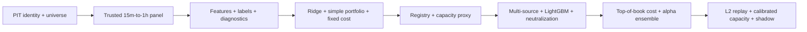

# Cross-Sectional Alpha Pipeline Roadmap

验收只看数据、可复现性、泄漏、诊断、成本与治理，不设拍脑袋收益目标。任何正收益都不能替代 phase acceptance。

## Phase 1 — 最小可用 cross-sectional pipeline（1–2 周）

### Scope

1. 新增 PIT instrument snapshot 最小字段：canonical ID、venue symbol、market type、linear/perp、status、onboard/delist effective time、tick/step/min notional（历史缺失字段允许明确 unknown，但不能伪造）。
2. 从当前 Binance 全市场 `15m` Vision 档案因果聚合 `1h` panel；固定全市场截止日，避免少数主力尾部污染。
3. 实现 `historical_dynamic` 与 `current_top_n_retrospective` 两种 universe mode、manifest 和 biased watermark。
4. 提炼 per-symbol feature + per-ts cross-sectional transform 两阶段 pipeline，冻结约 `45` 个 baseline features。
5. 提炼 `4h/24h` raw/long/short/market residual/BTC-beta residual/rank/tail labels。
6. 实现 IC/RankIC/ICIR、quantile、monotonicity、decay、coverage、breadth、turnover、time/fold stability、feature correlation。
7. 实现 Ridge baseline 与固定的 purged expanding walk-forward；禁止 random split。
8. 实现 equal-weight top/bottom decile、score-proportional control、dollar-neutral、single-name/gross/liquidity cap、allow-cash。
9. 成本先用 conservative taker fee + `4bps/fill` + actual funding；输出 ADV participation capacity proxy。
10. 实现 append-only experiment registry 最小版，记录 spec/dataset/universe/features/labels/git/seed/trials/results SHA。

### Deliverables

- versioned cross-sectional shared kernel `v1`；
- instrument/universe/panel/feature/label/dataset manifests；
- baseline OOF predictions；
- diagnostics bundle；
- orders/weights/turnover/cost/funding ledger；
- capacity proxy curve；
- immutable experiment receipt；
- 中文结果报告，状态仅为 `explore / diagnostic-only / not promoted / not live-ready`。

### Acceptance criteria

- 全市场 data cutoff 之前每个纳入 symbol 的 `15m -> 1h` 聚合只含完整四根，UTC 边界正确；
- `(ts, instrument_id)` 无重复，所有 feature/label/universe rows 可追溯到 manifest SHA；
- future perturbation、two-symbol cross-talk、K0/K1/Kh、missing path、long/short funding sign 测试全过；
- retrospective universe 输出强制带 survivorship-biased 标记，不能进入 OOS registry；
- 每个 outer fold 的 prediction 都是 OOF；purge >= longest horizon；
- diagnostics 不以 CAGR 为入口，并能在纯规则 score 上完整运行；
- portfolio 账本满足 dollar-neutral tolerance、权重/turnover/cost 守恒；
- capital 增大时 capacity proxy cost 不下降；
- registry 实际 trial count 与生成 artifacts 数量一致，experiment 不可覆盖；
- `python scripts/governance/preflight.py` 与新增定向 tests 通过；
- 不读取或改写旧 MHCSML prospective outcome，不触碰现有 CTA/HYPE family。

### Stop rule

若 instrument/universe/panel/label 任何 P0 gate 失败，停止模型和组合研究；不得用 LightGBM 或删样本掩盖数据问题。

## Phase 2 — 多数据源、ML、中性化与真实成本

### Scope

1. Binance 全市场 OI、premium/index/basis 与 top-of-book 历史；Hyperliquid instrument/ohlcv/funding/top-of-book 全市场。
2. 为每个 dataset 建 event_ts/available_ts/max-staleness/as-of audit。
3. LightGBM common adapter；XGBoost 只作第二树模型 control；简单 MLP 只在固定小网格下作 nonlinear control。
4. market/BTC beta exposure model、residual labels、dollar/beta-neutral constraints。
5. optional sector/theme、liquidity、volatility neutralization arms；先 attribution，后 residualization。
6. maker/taker fee tiers、historical spread/top-of-book slippage、tick/step/min notional rounding/rejection。
7. turnover penalty、position/liquidity cap；简单 shrinkage covariance optimizer 作为对照。
8. Alpha library、score/position/PnL correlation、equal/IC-weight/ridge ensemble、marginal contribution。
9. PSR/DSR、PBO/CSCV、BH-FDR 与 registry trial families。

### Acceptance criteria

- 每个非 OHLCV join 都有 availability/staleness test，未来 revision 不改变历史 feature；
- OI/basis/top-of-book 的 universe-time coverage 报告可证明不是少数币/少数 regime 代理；
- LightGBM/XGBoost/MLP 与 Ridge 在完全相同 folds、labels、costs、portfolio 上比较；
- 每个模型报告 OOF IC/RankIC/ICIR、quantile、decay、stability、cost-adjusted return；
- neutralization 前后 exposure 与 alpha loss 均可量化；任何 hard neutralization 都有无 neutralization control；
- cost ledger 可拆 fee/spread/slippage/funding/rounding，且逐订单可复算；
- capacity curve覆盖固定 capital grid，并显示约束开始 binding 的资金规模；
- alpha ensemble 报告 leave-one-out marginal IC/IR/PnL/cost/capacity contribution；
- multiple-testing 报告与 registry trial count 一致；
- 仍不以收益达到某阈值作为平台验收。

### Stop rule

若新增数据在 PIT coverage、available_ts 或 source parity 上失败，只保留 schema/coverage 诊断，不允许模型用 missingness 学习其上线时期。

## Phase 3 — 高频/微观结构、容量与 shadow

### Scope

1. Binance/Hyperliquid trades、top-of-book、L2 snapshot + delta、liquidations、venue status events。
2. event-time clock、sequence gap/recovery、clock skew、packet/source latency。
3. intrabar/orderbook replay：queue/partial fill/cancel/reject/rounding/market impact。
4. empirical impact calibration：order size / depth / ADV、vol、spread、venue/regime。
5. cross-venue symbol mapping、funding/fee/routing 与 inventory constraints。
6. shadow runner：实时 universe/features/scores/target weights/orders，不下真实单；与 research artifacts 逐字段 parity。
7. restart recovery、missing data fail-closed、kill switch、stale signal expiry、audit ledger。

### Acceptance criteria

- snapshot+delta 可重建 orderbook，sequence gap 全部可检测并 fail closed；
- replay 不使用 bar high/low 猜成交顺序；
- partial fills、queue assumptions 与 unfilled orders 明确并可压力测试；
- impact model在保留时段/不同 capital buckets 有校准误差报告；
- capacity curve用 observed depth/replay，capital 增大时 alpha-after-cost 衰减可解释；
- shadow 每个 signal/feature/weight/order 与同时间 research replay parity；
- shadow 至少覆盖预注册时长和主要 regime，且无 silent data/clock/restart mismatch；
- 只有策略家族另行通过 promotion/handoff gate 后，才讨论 dry-run/live。

### Stop rule

任何 orderbook sequence、latency、fill 或 restart blocker 都使 shadow `BLOCKED`；不得用理论 mid-price PnL 替代执行证据。

## 推荐顺序

不要把 LightGBM 放在 instrument/universe/diagnostics 之前，也不要在真实成本数据缺失时宣称找到了低容量高年化 alpha。
